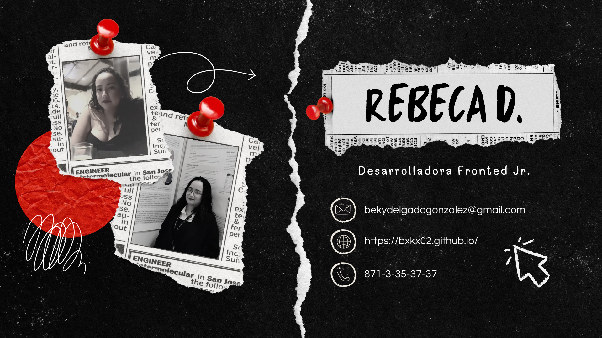

# Hola hola👋

<ul>

<li><b>👤 Nombre:  </b> Rebeca Delgado González</li>
<li><b>😄 Pronombres: </b>  Ella/El </li>
<li><b>📍 Estado:  </b> Durango 🇲🇽 </li>
<li><b>📣 Idiomas: </b>  Español, Ingles (intermedio) </li>
<li><b>💼 Ocupación: Estudiante de Medicina; Desarrolladora Fronted Jr

[https://malinali.dev/](https://bxkx02.github.io/)
	
</ul>

<h3 align="left">Languajes:</h3>
	
	

<!--¡Hola!, soy ***Rebeca,*** desarrolladora web Jr, apsionada por la tecnología, aquí encontrarás información sobre mi.
________

Sobre mi:
  n
<!--
**Bxkx02/Bxkx02** is a ✨ _special_ ✨ repository because its `README.md` (this file) appears on your GitHub profile.

Here are some ideas to get you started:

- 🔭 I’m currently working on ...
- 🌱 I’m currently learning ...
- 👯 I’m looking to collaborate on ...
- 🤔 I’m looking for help with ...
- 💬 Ask me about ...
- 📫 How to reach me: ...
- 😄 Pronouns: ...
- ⚡ Fun fact: ...
-->
